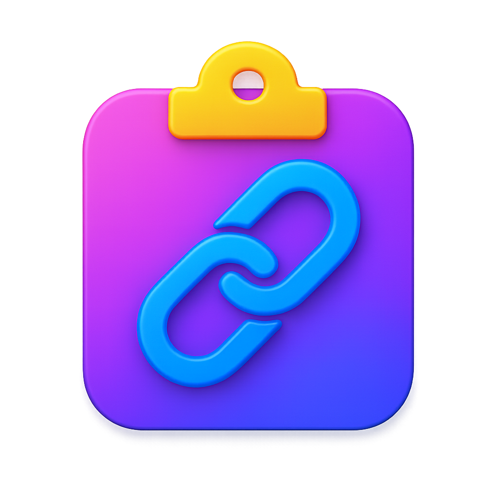

# CopyURL.app

<https://github.com/remino/copy-url>

macOS App to copy URL to clipboard

By Rémino Rem <https://remino.net/>

I use [Choosy](https://choosy.app/) to open URLs in different browsers. But
sometimes, I wish it had an option to let me just copy the URL it gets.

I tried making an app with Automator, but it cannot accept URLs—only files.
Instead, I needed a real app to do that. I don't know anything about Swift, so I
vibecoded this simple app one night, added it as a browser in Choosy, and it
works beautifully.

The app has no UI and it only does one thing: copy the URL it receives into the
clipboard then exit. If you start the app on its own, it'll do nothing but
terminate itself.

## Installation

You can download the `.zip` file from the
[latest release page](https://github.com/remino/copy-url/releases/latest), unzip
it, and copy `Copy URL.app` in your `Applications` folder.

You can also clone the repo and build the app from its code yourself with Xcode.

### 👋 First time opening?

Because this app isn’t notarized (yet), macOS will show a warning.

To open it anyway:

1. Right-click the app and choose "Open"
2. Click "Open" in the security prompt
3. From then on, it will open normally
